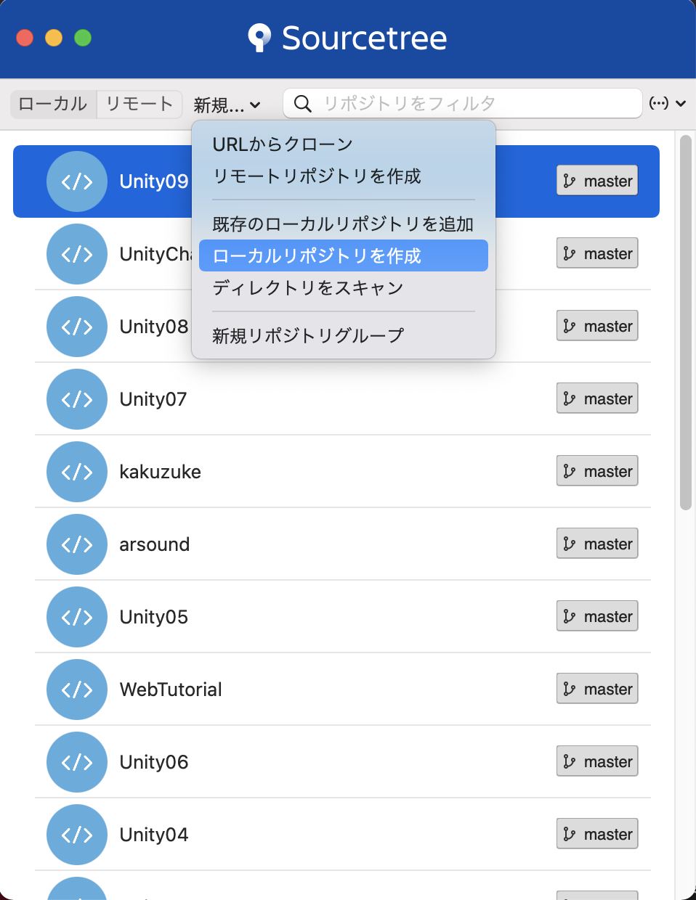

# Gitの基本的な使い方

## Gitとは

<br>

### Gitの概要


Gitを簡単に説明すると、バージョン管理システム、つまり変更履歴を管理するシステムの一つです。

例えば、自身で新しいWebサイトを作成しているとします。  
そこで新しい追加機能、例えばGoogleフォームを埋め込んでみたり、地図を表示するようにしたいとします。

ところが実際に実装してみたところ、うまく動かないばかりか、新機能実装前までは正常に動いていた部分までもおかしくなってしまいました。  
とりあえず元の状態に戻そうと考えますが、だいぶコードを追加してしまったため、どこを追加したのかわからなくなってしまったとします。

エディタの「戻る」ボタンでもある程度は戻れますが、一度エディタを閉じてしまうと戻れなくなってしまいます。  
一番身近な方法としては、新機能追加前のファイルをコピーしておいて、別のフォルダなどにバックアップとして保存しておくことです。ですが、この方法だと新機能の追加やバグ修正作業のたびに新しくバックアップを作成し保存しなければなりません。また、バックアップが増えてくるとどのファイルがどの機能追加前のバックアップなのか、最新の状態はどのファイルなのかがわからなくなる可能性があります。


さらに、複数人で同じプロジェクトを編集する場合、誰が最後に書き換えたのか、どこをどのように変更したのかを共有するのが大変だったり、同時に同じファイルを変更して先に編集した人のデータを消してしまうといった問題が発生するかと思います。このような問題を解決するためにGitというシステムが開発されました。

---

### 分散型バージョン管理システム

現在のバージョン管理システムは集中型バージョン管理システムと分散型バージョン管理システムがあり、Gitは分散型のバージョン管理システムの１つです。

分散型と集中型の詳細の説明は省きますが、詳しく知りたい方は[こちら](https://www.atmarkit.co.jp/ait/articles/1307/05/news028_3.html)をご確認ください。

分散型バージョン管理システムを簡単に説明すると、ローカル環境（自分のPCなど）にも変更履歴を含む完全なリポジトリの複製を作成する仕組みのことです。

ローカル環境なので、インターネットに繋がっていなくてもバージョン管理を行うことができます。

---

### ローカルリポジトリとリモートリポジトリ

リポジトリとは直訳すると「貯蔵庫」という意味になります。

バージョン管理システムで使用するリポジトリとは、そのファイルの変更履歴やファイル自体を記録しておく場所のことです。

そしてこのリポジトリにはローカルリポジトリとリモートリポジトリの２つがあります。

- ローカルリポジトリ
  - 自身のパソコンなどで使用するリポジトリ
- リモートリポジトリ
  - サーバーに配置して別のパソコンや複数人で共有するためのリポジトリ
  - 
ローカルリポジトリはリモートリポジトリにアップロードしなければ自分のパソコン上だけで変更履歴を管理できるので、複数人で別々の作業を効率よく行うことができます。

---

### Gitの用語

Gitを使う上で一番学習を難しくしているのが専門用語の多さです。

プログラミングを学ぶ上ではどうしても専門用語を多く覚える必要があるのですが、専門用語はどの分野でも必ず必要になる知識なので少しずつ覚えていきましょう。

今回はGitを使う上で必要になる基本的な用語をいくつか紹介します。

|  |  |

| 用語 | 意味 |
| :-- | :-- |
| リポジトリ | ファイルやディレクトリの状態を記録する場所。 |
| ディレクトリ | 基本的にはフォルダと同義。（厳密には違う） |
| コミット | ファイルやディレクトリの追加・変更をリポジトリに記録すること。コミットを行うことで変更履歴を記録できる。（１つ前の状態に戻す＝１つ前のコミットに戻す）|
| ワークツリー | Gitの管理下に置かれたディレクトリのこと。 |
| インデックス | リポジトリにコミットする準備をする場所。リポジトリとワークツリーの間にある。（ステージング・エリアとも呼ばれている） |
| ブランチ | コミットの履歴を分岐すること。バリエーション違いを作れる。リポジトリを作った時に自動で作られる（デフォルトの）ブランチが「master」ブランチ。ちなみにブランチを作ることをGitでは「ブランチを切る」と言う。 |
| マージ | ブランチとブランチを合体させること。 |

<p class="point">
Gitでは、コミットを実行したときにワークツリーから直接リポジトリ内に状態を記録するのではなく、その間にあるインデックスの設定された状態を記録するようになっています。なぜそのようになっているのかというと、ワークツリー内にあるコミットする必要のないファイルを除外したり、ファイルの一部の変更だけをコミットできるようにするためです。そのためコミットしたいファイルだけをインデックスに登録して履歴を残すシステムになりました。
</p>

これ以外にもたくさん専門用語があるのですが、そちらはこの教材を通して学んでいきましょう。

---

<br>

## Gitの使用方法

Gitを使う方法は色々あるのですが、大きく分けて2つあります。

１つはターミナル・コマンドプロンプトからテキストで操作する方法（CUI）と、もう１つはマウスなどを使って直感的に操作する方法（GUI）です。

よくGitの初心者向けの情報サイトなどにはGUIツールを使った説明が紹介されています。

しかし、Gitの使い方がよくわからない状態でGUIツールをインストールして使ってみると、どのボタンがどのような意味なのかよくわからないまま手順通りマウスをクリックしていくだけになってしまって、予期せぬエラーの対処方法やGUIツールを変更したら操作方法が分からなくなってしまったなんてことが起きてしまいます。

もちろんGUIツールは非常に便利で、使い方と操作の意味さえ理解できればGit管理が非常に楽になります。

GitのGUIツールとしてとても有名なものに「Sourcetree」というものがあります。


Sourcetreeは多くの企業で使われているGit無料クライアントです。

Sourcetreeは、Atlassian社が提供しており、GitだけでなくMercurial（hg）にも対応しています。Gitのファサードとして働き、GUIでの操作により内部でGitコマンドを実行してくれる仕組みになっています。そのため、Gitコマンドを知っておくと、内部でどのようなコマンドが実行されているのか、よりイメージしやすいでしょう。

グラフィカルなインターフェイスを備えており、リポジトリの操作を視覚的に行うことができます。コマンドを打つ必要がないため、コマンドの打ち間違えが発生することもありません。また、Gitの代表的なブランチモデルのひとつである、「git-flow」に対応しています。ワンクリックでgit-flowの操作が行えるので、同ブランチモデルを採用しているプロジェクトでは非常に役立つことでしょう。

---

<br>

## ローカルリポジトリの作成

まずは新規でローカルリポジトリを作成しましょう。



SourceTreeから「新規 -> ローカルリポジトリを作成」を選択してください。

そして保存先を指定して作成を押してください。


そうすると、このように新規でリポジトリが作成されました。

<br>

## コミットしてみる

今回は初めてのGitなので、Unityではなく簡単なHTMLファイルを作成してそちらを利用したいと思います。

こちらのフォルダに新規で「index.html」ファイルを作成し、以下のコードを記述して保存してください。

```html
<!DOCTYPE html>
<html lang="ja">
<head>
    <meta charset="utf-8">
    <title>Gitテスト</title>
</head>
<body>
    <h1>初めてのGit</h1>
</body>
</html>
```

書き終わりましたら保存してあることを確認し、Sourcetreeを開きましょう。


そうすると、このようにSourceTreeが変更されました。


次にGitにコミットしたいファイルにチェックをつけます。基本的に全ての変更ファイルをコミットするかと思いますので、「保存先のファイル、パス順」というところのチェックボックスにチェックをつけていただくと全てのファイルがチェック状態になります。

これがインデックスに登録状態です。

最後にコミットメッセージに「first commit」と入力し、右下のコミットをクリックすればコミットは完了です。


履歴を確認してもらうときちんと先ほどのindex.htmlファイルが登録されているのが確認できます。

少しindex.htmlファイルを変更してみましょう。

```html
<!DOCTYPE html>
<html lang="ja">
    <head>
        <meta charset="utf-8">
        <title>Gitテスト</title>
    </head>
    <body>
        <h1>初めてのGit</h1>
        <p>変更部分</p>
    </body>
</html>
```


そうすると、このようにまたSourcetreeに変更が反映されますので同じようにチェックをつけてコミットメッセージを入力し、コミットをしてください。


履歴を確認すると、このように変更内容が反映されています。

