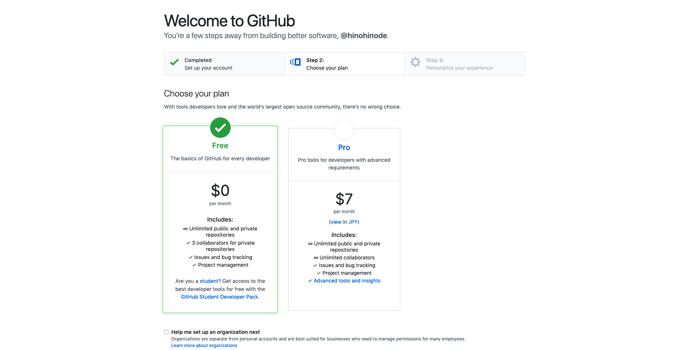
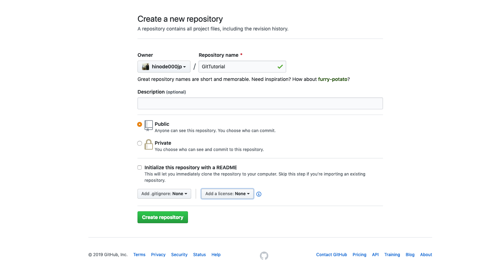
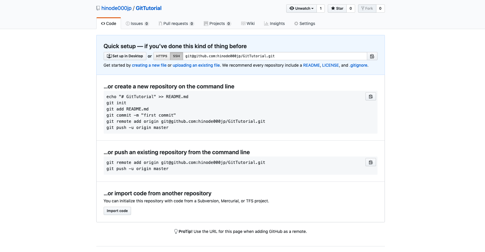
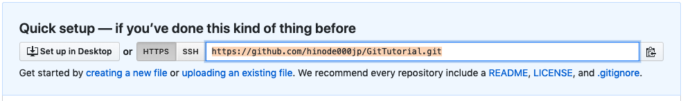

# Gitの基本的な使い方２

## リモートリポジトリとは

 

ローカルリポジトリは自身のパソコンなどに履歴を記録しておくものでした。

一方リモートリポジトリとは、インターネット上もしくはその他のネットワーク上に履歴を記録しておくものです。

他のメンバーと共同で作業を進めるためには、このようなリモートリポジトリを管理し、必要に応じてデータをアップロードしたり他の人が編集したデータを自身のパソコンに持ってきたりなどして作業を分担していくことになります。

## GitHubを活用

Gitのリモートリポジトリを管理するホスティングサービスは数多く存在します。

１番有名なものとしては「GitHub」があり、現在多くのエンジニアや企業で使われています。

GitHub以外にも、「BitBucket」や「Backlog」、「Gitlab」など様々なホスティングサービスがあり、それぞれ特徴があるので予算や用途などに合わせて１番良いホスティングサービスを探してみて下さい。

今回は無料でも使用できる「GitHub」でリモートリポジトリを管理していきたいと思います。

## GitHubアカウントを作成

まずは[GitHubのサイト](https://github.com/)へアクセスします。すでにGitHubアカウントを持ってる方はこちらは飛ばして下さい。

そこで

1. ユーザー名
2. メールアドレス
3. パスワード

を登録し、「Sign up for GitHub」をクリックします。

次にプランの選択画面が出るので、「Free」を選択して指示にしたがって必要事項を記入していきます。

登録が終わると、GitHubから登録したメールアドレスに確認メールが届くので、そのメール内にある「Verify email address」ボタンを押してください。そうしますと、GitHubのページと、「Welcom to GitHub」というメールが届いてGitHubへの登録は完了です。

 

## 新規リモートリポジトリの作成

登録が完了したら、チュートリアルのためのリモートリポジトリを作成したいと思います。

まずはGitHubのトップページから画面の右上の「＋」ボタンを押して「New repository」を選択して下さい。

次に、下のような画面になったらリポジトリ名を記述します。今回は「GitTutorial」という名前でリポジトリを作成します。

今回はサンプルとして「GitTutorial」という名前のリモートリポジトリ にしましたが、実際に自分のプロジェクトで使用する場合は自身のプロジェクト名などにしてください。

Descriptionはこのリモートリポジトリの説明などを記載します。

次にPublicかPrivateを選択できます。以前はPrivateは有料版のみでしたが現在は無料版でもPrivate（非公開）のリポジトリを作成することができます。

その下のチェックボックスでREADMEを追加するかどうかを選択できます。READMEにはこのリポジトリの概要や使い方などを記載できます。

​

今回はリポジトリ名以外は変更せず進めていきたいと思います。

リポジトリ名を「GitTutorial」にして、下の「Create repository」をクリックして下さい。

そうしますと、このような画面になったかと思います。
これで新規のリモートリポジトリを作成することができました。

---

## リモートリポジトリにプッシュしてみる

では早速新規作成したリモートリポジトリにプロジェクトをアップロードしていきたいと思います。

リモートリポジトリで自分の手元のローカルリポジトリの変更履歴を共有するには、ローカルリポジトリ内の変更履歴をアップロードする必要があります。Gitではこのアップロードする操作のことをPushと呼んでいます。Pushを実行するとリモートリポジトリに自分の変更履歴がアップロードされて、リモートリポジトリ内の変更履歴がローカルリポジトリの変更履歴と同じ状態になります。

まずは先ほどGitHubで作成したリモートリポジトリのページから

こちらのURLをコピーしておきます。左側に「HTTPS」か「SSH」を選択できるタブがあるのですが、今回は「HTTPS」の方を選択して下さい。

